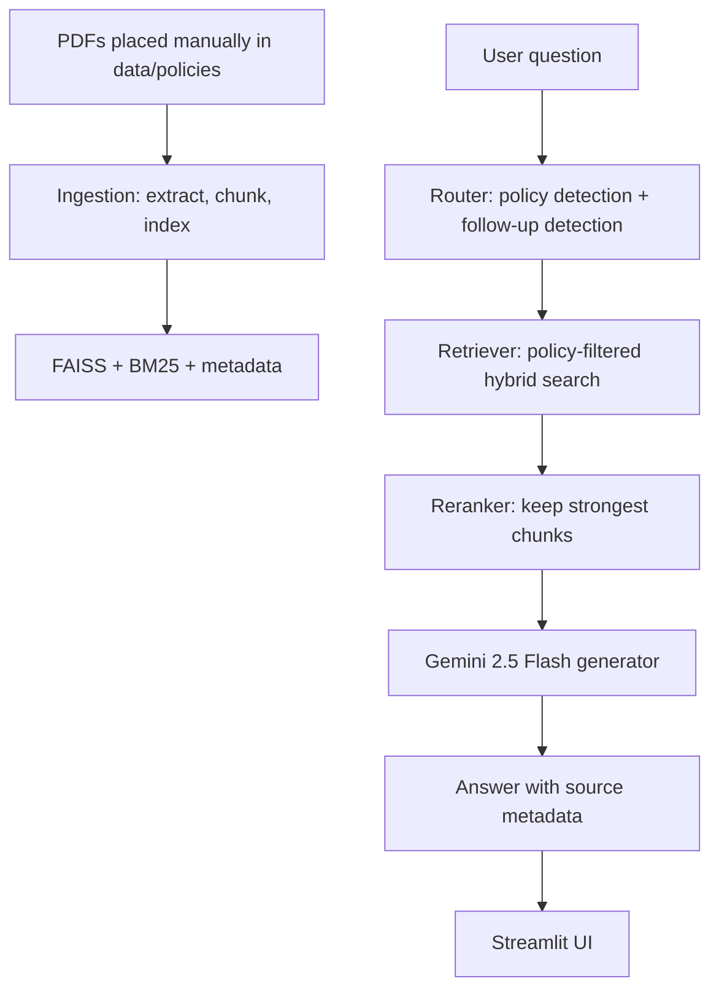

# Coforge India HR Policy Assistant

This project is a small but production-minded POC for a grounded HR policy assistant. It answers employee questions only from the India-specific policy PDFs manually placed in the `data/policies/` folder. It does not download documents or use general world knowledge as policy evidence.

## Project overview

The app runs as a simple Streamlit chatbot with:

- PDF discovery under `data/policies/`
- page-aware extraction with PyMuPDF
- section-aware chunking and metadata retention
- policy name routing and follow-up detection
- hybrid retrieval using BM25 + FAISS-style vector similarity
- lightweight reranking
- Gemini 2.5 Flash final answer generation
- source grounding in the UI

This is intentionally a POC and is meant to be easy to explain in an interview.

## Architecture diagram



## Why RAG is used

The workflow uses retrieval-augmented generation because HR policy answers must be grounded in the actual policy documents. The system does not rely on general knowledge or assumptions. It retrieves the most relevant text from the available policy PDFs, then asks the LLM to answer based on only that evidence.

## Project structure

```text
coforge-hr-policy-chatbot/
├── app.py
├── config.py
├── requirements.txt
├── .env.example
├── .gitignore
├── README.md
├── data/
│   └── policies/
├── indexes/
│   ├── faiss.index
│   ├── chunks.json
│   └── bm25.pkl
├── src/
│   ├── __init__.py
│   ├── ingestion.py
│   ├── chunking.py
│   ├── embeddings.py
│   ├── policy_registry.py
│   ├── router.py
│   ├── retriever.py
│   ├── reranker.py
│   ├── conversation.py
│   ├── generator.py
│   └── pipeline.py
└── tests/
    ├── test_chunking.py
    ├── test_router.py
    ├── test_retriever.py
    └── test_pipeline.py
```

## Setup instructions

### 1. Create the Python environment

```bash
python -m venv .venv
# Windows PowerShell
.\.venv\Scripts\Activate.ps1
# macOS / Linux
source .venv/bin/activate
```

### 2. Install dependencies

```bash
pip install -r requirements.txt
```

### 3. Configure the Gemini key

Create a `.env` file from `.env.example` and put in the API key:

```bash
copy .env.example .env
```

Then edit `.env` and set:

```env
GEMINI_API_KEY=your_key_here
```

The project will use `gemini-2.5-flash` by default.

### 4. Place PDFs in the correct folder

Manually place all India HR policy PDFs in:

```text
data/policies/
```

The app does not download PDFs automatically. It only reads whatever is already there.

### 5. Build the indexes

```bash
python -m src.ingestion
```

This discovers PDFs, extracts pages, chunks the text, and writes the local indexes to `indexes/`.

### 6. Start the app

```bash
streamlit run app.py
```

## How policy routing works

The router uses deterministic matching before doing any expensive retrieval.

- If a policy name or alias is found in the user question, it routes to that specific policy.
- If no policy is explicitly named, it checks whether the question looks like a follow-up.
- If it looks like a follow-up and the previous active policy is strong, it continues in that policy.
- Otherwise, it searches across all policies.

This is intentionally lightweight and avoids unnecessary LLM-based classification.

## How follow-up questions work

The conversation layer keeps a light session state:

- active policy
- last question
- last answer
- recent sources
- recent topic

Examples of obvious follow-ups include:

- "What about reporting it?"
- "How do I do that?"
- "What happens next?"
- "Does this apply to contractors?"

When confidence is high, the assistant stays within the same policy context rather than re-searching blindly across all documents.

## How hybrid retrieval works

The retrieval system combines:

1. BM25 keyword matching for exact policy terms and section names
2. FAISS vector retrieval for semantic similarity
3. metadata filtering by policy when a specific policy was detected

This keeps the search both precise and flexible.

## Chunking strategy

The ingestion pipeline extracts text page-by-page and creates page-aware, section-aware chunks. It prefers policy headings and natural section boundaries instead of arbitrary fixed boundaries. Chunks include metadata such as:

- chunk_id
- policy_name
- source_file
- page
- section
- country
- text

The chunk size and overlap are configurable in `config.py`.

## Reranking strategy

After hybrid retrieval, the code reranks a small candidate set to keep the most relevant chunks for the final answer. This avoids sending too much low-value context to the LLM and helps keep the answer complete without flooding the prompt.

## Hallucination prevention

The system is designed to refuse unsupported answers.

Examples:

- If a user asks about something not in the PDFs, it says it could not find the information in the available policy documents.
- It never uses general-world knowledge as a source for HR policy guidance.
- It checks the actual retrieved evidence before generating a final answer.

## Latency optimizations

The implementation keeps a simple but practical latency profile:

- PDFs are never parsed at query time
- embeddings are precomputed during index build
- the FAISS index is loaded once and cached
- BM25 results and policy metadata are loaded once
- policy routing happens before broad retrieval
- only a small top-K candidate set is reranked before prompting the model

## Testing

Run the test suite with:

```bash
pytest -q
```

The tests cover chunk generation, routing, retrieval, and a small end-to-end pipeline path.

## Known limitations

This is a POC, not a full enterprise system.

- PDFs must be supplied manually
- policy matching is deterministic and lightweight rather than advanced NLP
- some section detection can be imperfect on messy extracted PDFs
- the retrieval layer is intentionally simple and readable
- the app is designed for a small internal policy set, not huge corpora

## Future production improvements

Potential next steps:

- add explicit policy alias management
- improve section extraction and table parsing
- support document versioning and policy freshness checks
- add more robust metadata and audit logging
- add evaluation tests against real policy questions
- replace the local retriever with a production-grade search stack if needed

## Important note

This project is intentionally simple and grounded. Do not add automatic downloading, scraping, or web acquisition. The only valid source of truth is the manual set of PDFs in `data/policies/`.
